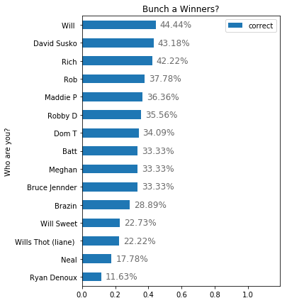

# GOT DEATH POOL BITCHES: Haltime Report
So we finally get some fucking blood for the BOBBY-B god (Not enough in this humble servants opinion). Now we get to see who's on track to sit on the iron throne of bets, who picked the right wights, and who's shit outta luck (read this guy). Additionally, since the Night King's fate was sealed (probably) this episode, we'll have a look at who predicted wolverine to swoop in for the massive kill steal. As a reminder the questions were:

*   Does the Night King Die?
*   If so, whodunit?

As a reminder, this is only a update to the current status of the cast and crew. The death pool only counts character status at the end of the season and assumes all off screen characters to be currently alive until their death is mentioned or shown (i.e. Ellaria Sand (yes, we did fuck up and put Elia Sand (who is definitely dead) instead of the paramour of Oberyn Martell (which is who we were initially referring to))).

As a bonus, we happen to have the GOAT, the man, the myth, the Legend27 himself, Bobby-B the one true king of the seven kingdoms himself providing commentary throughout. Why don't you give the readers a few words before we get started Bobby-B

## I'VE GOT SEVEN KINGDOMS TO RULE! ONE KING, SEVEN KINGDOMS!

Well, uh, we do appreciate you tak--

## START THE DAMN JOUST BEFORE I PISS MESELF!

On that note, let's get started

## The Picks

### Who are the optimists?

Those who had the most characters surving the trials and tribulations of Season 8, and to those of you at the top of this list I ask, "What's the matter? Can't handle more crippling emotional trauma of having characters you've bonded with snatched by the cold hands of death? Do you also still wet the bed?" Perhaps the lord of the seven kingdoms can talk some sense into these lost sheep.

## YOU'RE MY COUNCIL, COUNSEL! SPEAK SENSE TO THIS HONORABLE FOOL!

Uh, I already tried that, your grace. I don't think they can be reasoned with at this point

## PISS ON THAT! SEND A RAVEN! I WANT YOU TO STAY! I'M THE KING, I GET WHAT I WANT!

Well, maybe they'll see the error of their ways when more of their favorites die (hopefully)

### Who are the Negative Nancy's
Those who predicted that most of the characters fates were sealed by being born into a fantasy universe where the prophecies are made up and the lives don't matter. These fucks probably enjoy watching show casuals wrench about in pain and suffering as they watch their favorite characters get killed far earlier than traditional narratives call for. I'm sure we can all agree that only the finest can be counted among these ranks, can't we Bobby-B?

## COME, BOW BEFORE YOUR KING! BOW, YA SHITS!

I'm sure they're all lined up and ready to pay their respects to you, your grace.

## TAKE ME TO YOUR CRYPT, I WANT TO PAY MY RESPECTS!

Uh, I'm not so sure you want to go there right now.

## HOLD YOUR TONGUE!

... moving on

### Who actually used the Wight option?
Yes, this was an option initially proposed when the death pool was first opened, and I'll be honest, I actually didn't expect anybody to wind up on this list because the showrunners ARE SPINELESS COWARDS WHO DON'T EVEN KNOW HOW TO STICK THEM WITH THE POINTY END!
## THEY NEVER TELL YOU HOW THEY ALL SHIT THEMSELVES! THEY DON'T PUT THAT PART IN THE SONGS!
RIGHT!? IF OUR ONE TRUE KING WERE STILL RUNNING THINGS, WE'D STILL HAVE PLENTY OF DEATH TO GO AROUND
## GODS I WAS STRONG THEN
I'd love to see the great Bobby-B smashing in some heads with his war hammer, but we should probably move on to the actual results

## The Results So Far
Throught the end of episode 3 here is the list of whose been most accurate at deciding the fate of our characters. I would like to take this time to declare that y'all are a bunch a bitches whose spinelessness is second only the the showrunners themselves who can't stop snorting HBO money likes its pure Colombian Bam-Bam. GIVE US MORE GHOST YOU BASTARDS! 
## HOLD YOUR TONGUE
Apologies, your grace, I just think it's unspeakable that the showrunners can't seem to pierce anymore plot armor.
## OH, IT'S UNSPEAKABLE TO YOU? WHAT HER FATHER DID TO YOUR FAMILY, THAT WAS UNSPEAKABLE!
Uh, I thought we weren't going to get into that. Can we just change the subject?
## YOUR MOTHER WAS A DUMB WHORE WITH A FAT ARSE, DID YOU KNOW THAT?
You know what, I'm just going to go back to my guard post and keep watch for the next episode
## FORCED TO MIND THE DOOR WHILE YOUR KING EATS AND DRINKS AND SHITS AND FUCKS!
...

